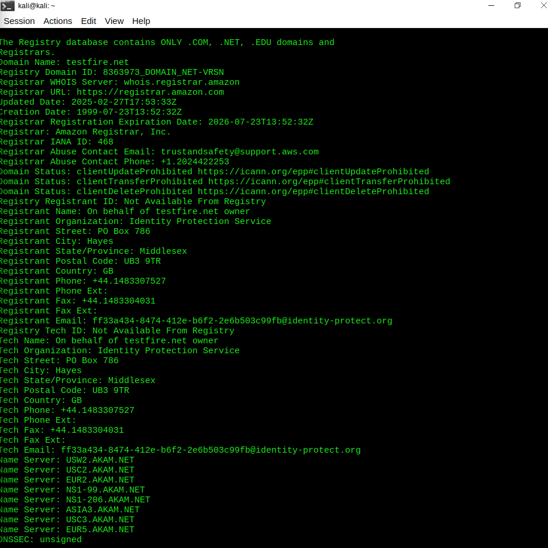
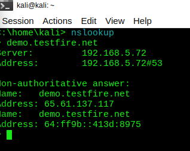
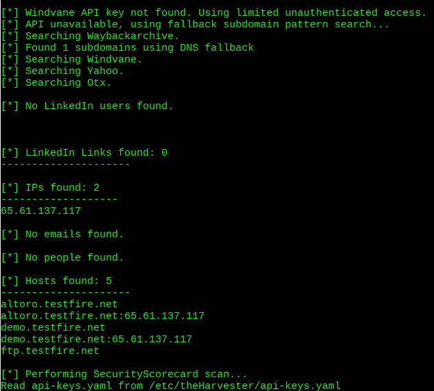
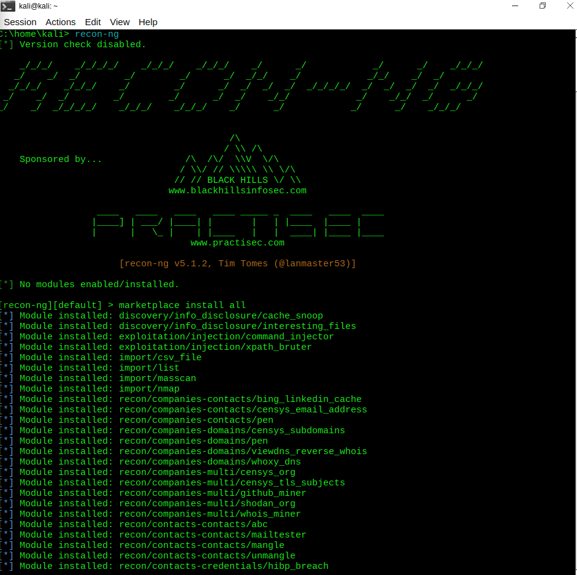
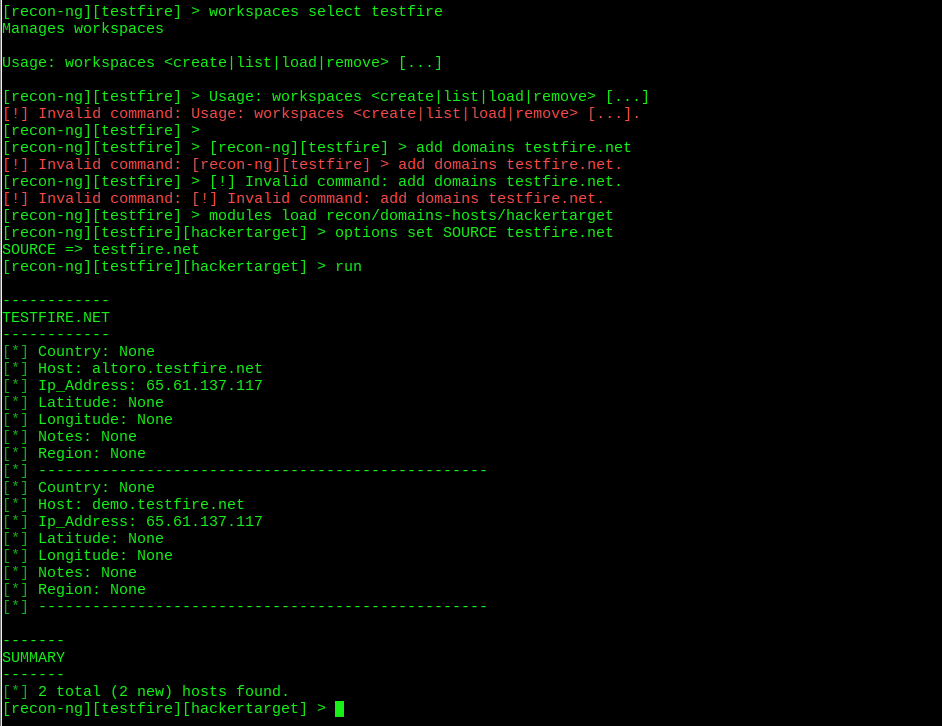
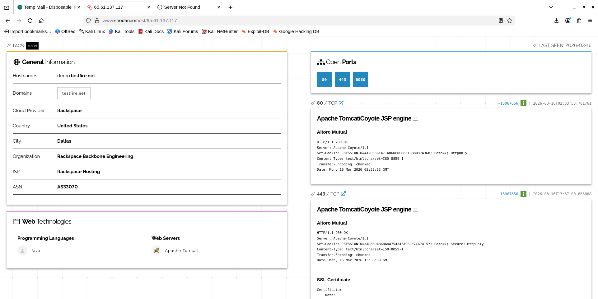
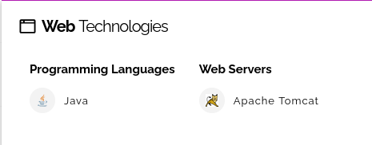

# 🔐 Footprinting & Reconnaissance – Altoro Mutual

## 📌 Project Overview

This project focuses on performing **Footprinting and Reconnaissance** on a target web application using various OSINT (Open Source Intelligence) tools.

The target used is a **demo vulnerable banking application**:
**Altoro Mutual (demo.testfire.net)**

---

## 🎯 Objective

* To gather publicly available information about a target
* To understand how attackers perform initial reconnaissance
* To practice real-world cybersecurity tools

---

## 🧠 Key Learnings

* Difference between **Passive and Active Reconnaissance**
* Collecting domain and network information
* Using multiple tools for OSINT analysis
* Understanding limitations of publicly available data

---

## 🛠️ Tools Used

* whois
* nslookup
* theHarvester
* Recon-ng
* Shodan

---

## 🔍 Commands & Techniques

### WHOIS

```
whois testfire.net
```

### DNS Lookup

```
nslookup demo.testfire.net
```

### theHarvester

```
theHarvester -d testfire.net -b all
```


### Recon-ng

* Created workspace
* Used modules like:

  * `hackertarget`
  * `crtsh`
* Gathered host and domain information

---

## 📊 Key Findings

### 🌐 Domain Information

* Domain: testfire.net
* Subdomain: demo.testfire.net

### 🌍 IP Address

* Example: 65.61.137.117

### 🔗 Subdomains Discovered

* demo.testfire.net
* [www.testfire.net](http://www.testfire.net)

### 📧 Email Information

* Limited public data available

---

## ⚠️ Limitations

* Some Recon-ng modules require API keys (Shodan, Censys, etc.)
* Limited OSINT data available for the demo target
* Search engines may restrict automated queries

---

## 📸 Screenshots

### Whois Output



### DNS Output



### theHarvester Results



### Recon-ng Output





### Shodan Output






---

## 🚀 Conclusion

This project demonstrates how footprinting and reconnaissance are crucial first steps in cybersecurity. Even with limited data, combining multiple tools helps in building a clearer picture of the target.

---

## ⚡ Author

Rudransh Patel
Aspiring Software Developer & Cybersecurity Enthusiast
